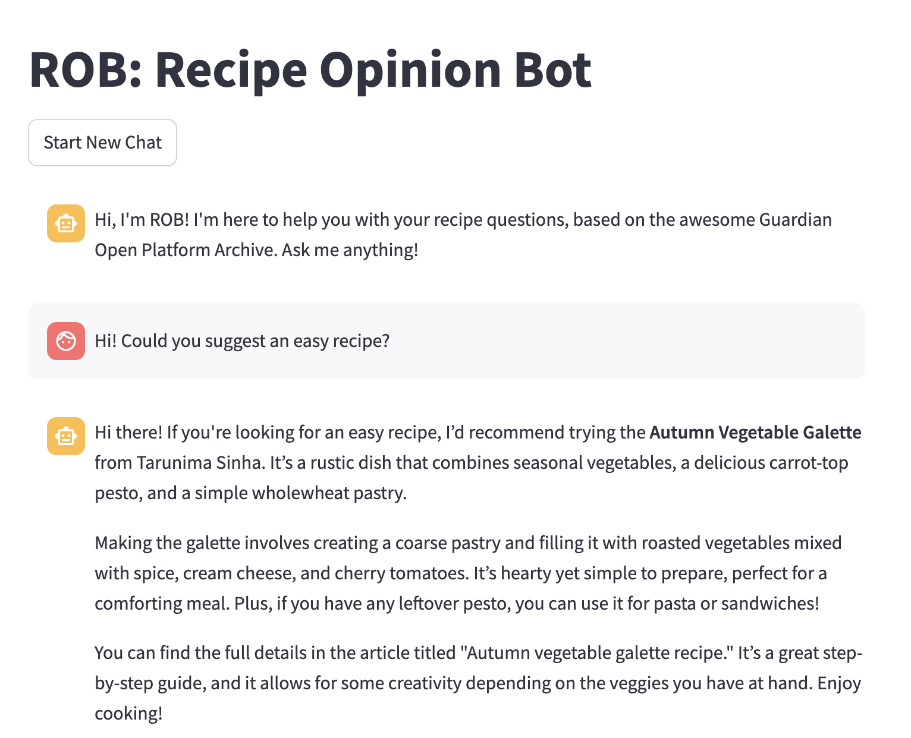

# ROB: The Recipe Opinion Bot 

A RAG-based chatbot for interactions with Guardian Recipes.
UI for the chatbot is built using Streamlit.
The data is retrieved from the Guardian Open Platform API.



## Table of Contents

- [About](#about)
- [Setup](#setup)
- [Usage](#usage)

## About

This project is a chatbot that uses the RAG (Retrieval-Augmented Generation) model to interact with Guardian Recipes.

## Setup

1. **Clone the repository:**
    ```sh
    git clone https://github.com/mstankai/recipe-rag.git
    cd recipe-rag
    ```

1. **Create a virtual environment:**
    ```sh
    python -m venv venv
    source venv/bin/activate
    ```

1. **Install dependencies :**
    ```sh
    pip install -r requirements.txt
    pip install -e .

    ```

1. **Set up your Guardian API key:**
    You can set up an API key on the Guardian Open Platform page, here: [Guardian Open Platform | Getting Started](https://open-platform.theguardian.com/access/).
    You will need this to download the Guardian Recipes.

    Store your API key in your system's keychain using the following command:
    ```sh
    python -c 'import keyring; keyring.set_password("system", "guardian_api_key", "<your-api-key>")'
    ```


1. **Set up OpenAI API key:**
    You can set up an API key on the Open AI Platform page, here:
   [OpenAI Platform | API Keys](https://platform.openai.com/api-keys).

    Store your OpenAI API key in your system's keychain using the following command:
    ```sh
    python -c 'import keyring; keyring.set_password("system", "openai_api_key", "<your-api-key>")'
    ```


## Usage
### Configure
There are two configuration files in the `config` directory:
- `data_config.json`: contains the configuration for the data retrieval
- `rag_config.json`: contains the configuration for the RAG model

### Produce data
Run the scripts in the `scripts` directory in order (`1_*`,`2_*`...) 
to produce the data and embeddings needed for the chatbot.
```sh
python scripts/xxx.py
```

### Run the app
Run the streamlit app to interact with the chatbot.
```sh
streamlit run app/🍡 recipe_recomender.py
```

### Questions and comments
Feel free to contact me if you have any questions, comments, or ideas!
